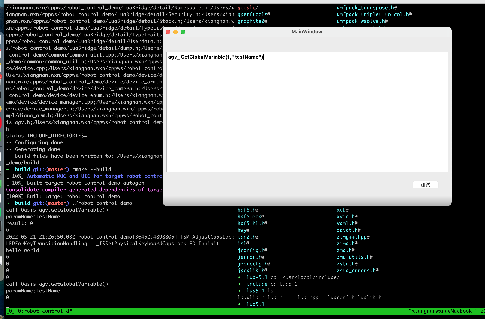

# robot_control_demo

* 机器人控制系统演示程序

## 目录说明
* device 设备相关抽象逻辑
* device/impl 具体设备实现类
* common 通用的逻辑
* LuaBridge lua与C++整合的组件
* config 设备配置文件

## 环境需求
* lua5.1版本
* qt5
* jsoncpp
* Eigen3

## 修改配置文件

### CMakeLists.txt
* CMAKE_PREFIX_PATH lib搜索路径
* CONFIG_PATH devices.json设备配置文件路径
* include_directories 设备include头文件搜索路径
* target_link_libraries 动态链接库位置 lua、jsoncpp等

### devices.json
* 配置设备列表修改
```
{
	"devices": [
	{
            "device_type": "AGV", //设备类型
            "device_id": 1 //设备ID
        
	},
	{
            "device_type": "CAMERA",
            "device_id": 2
        
	},
	{
            "device_type": "ARM",
            "device_id": 3
        
	}
    
	]

}

```

## 执行
* 创建build文件夹
```
#mkdir build
#cd build
```
* 执行cmake生成makefile
```
#cmake ..
```
* 执行编译
```
#cmake --build .
``` 

## 执行结果
* 文本框中输入lua脚本，点击测试运行。目前注册了函数agv_GetGlobalVariable
执行结果如下截图。
* 注册方法见lua_engine.cpp



